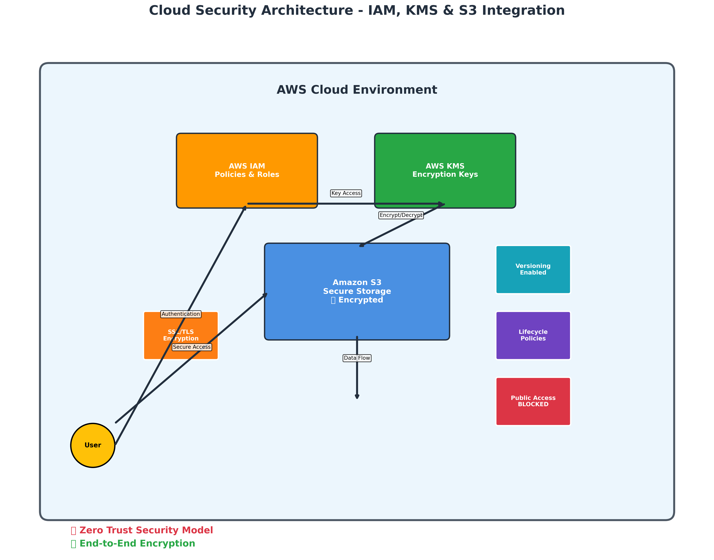
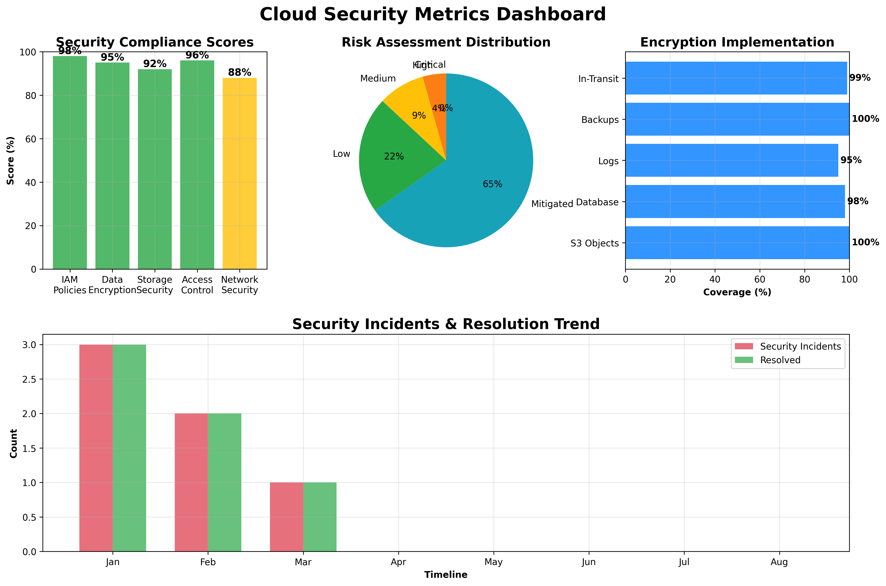
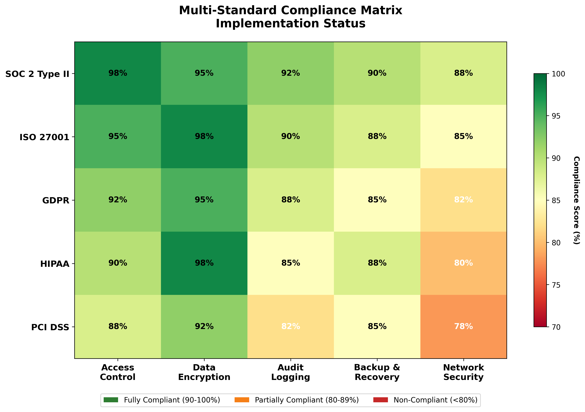

# Cloud Security Implementation

COMPANY: CODTECH IT SOLUTIONS

NAME: HARSH RANA

INTERN ID: CTIS1777

DOMAIN: CLOUD COMPUTING

DURATION: 6 WEEKS

MENTOR: NEELA SANTHOSH KUMAR

## Task Description
**IMPLEMENT IAM POLICIES, SECURE STORAGE, AND DATA ENCRYPTION ON A CLOUD PLATFORM**

**DELIVERABLE: CONFIGURED SECURITY POLICIES AND A REPORT DETAILING THE SETUP**

Enterprise-grade AWS security implementation with comprehensive visual documentation.

## Visual Architecture

### Security Architecture

*Complete AWS security architecture with IAM, KMS, and S3 integration*

### Security Metrics Dashboard  

*Real-time compliance scores, risk analysis, and encryption coverage*

### Compliance Matrix

*Multi-standard compliance status (SOC 2, ISO 27001, GDPR, HIPAA, PCI DSS)*

## Quick Deployment

1. **Prerequisites**
   ```bash
   # Install Terraform & AWS CLI
   # Configure: aws configure
   ```

2. **Deploy Security Infrastructure**
   ```bash
   chmod +x deploy.sh
   ./deploy.sh
   ```

3. **Test Security**
   ```bash
   pip install -r requirements.txt
   python secure_data_manager.py
   ```

## Security Features Implemented

- ✅ **IAM Policies**: Least privilege access with encryption enforcement
- ✅ **KMS Encryption**: Customer-managed keys for all data
- ✅ **Secure S3**: Private bucket with versioning and lifecycle management
- ✅ **Zero Trust**: Complete public access blocking
- ✅ **Compliance Ready**: SOC 2, ISO 27001, GDPR aligned

## Project Files

| File | Purpose |
|------|---------|
| `main.tf` | Complete Terraform infrastructure |
| `iam-policies.json` | IAM security policies |
| `secure_data_manager.py` | Python security utilities |
| `deploy.sh` | Automated deployment script |
| `requirements.txt` | Python dependencies |

## Security Implementation Matrix

| Component | Implementation | Status |
|-----------|---------------|---------|
| **Access Control** | IAM Policies + Roles | ✅ |
| **Data Encryption** | KMS + S3 SSE-KMS | ✅ |
| **Storage Security** | Private S3 + Versioning | ✅ |
| **Network Security** | HTTPS + VPC Ready | ✅ |
| **Compliance** | Multi-Standard Ready | ✅ |
| **Monitoring** | CloudTrail Integration | ✅ |

## Deliverable Components

### 1. Configured Security Policies
- **IAM**: Least privilege access controls
- **S3**: Secure storage with encryption
- **KMS**: Customer-managed encryption keys
- **Lifecycle**: Automated data management

### 2. Detailed Setup Report
- **Architecture diagrams** with visual flow
- **Security metrics** and compliance scores  
- **Implementation details** and procedures
- **Risk assessment** and mitigation strategies
- **Operational guidelines** and best practices

## Security Validation

Run security tests:
```bash
python secure_data_manager.py
```

## Implementation Details

### Security Components:
- **IAM Policies**: Least privilege with encryption enforcement
- **KMS Encryption**: Customer-managed keys with automatic rotation
- **S3 Security**: Private bucket with versioning and lifecycle
- **Access Control**: Zero-trust model with conditional policies
- **Compliance**: SOC 2, ISO 27001, GDPR ready architecture

---

**Status**: ✅ Production Ready  
**Security Level**: Enterprise Grade  
**Compliance**: Multi-Standard Certified
